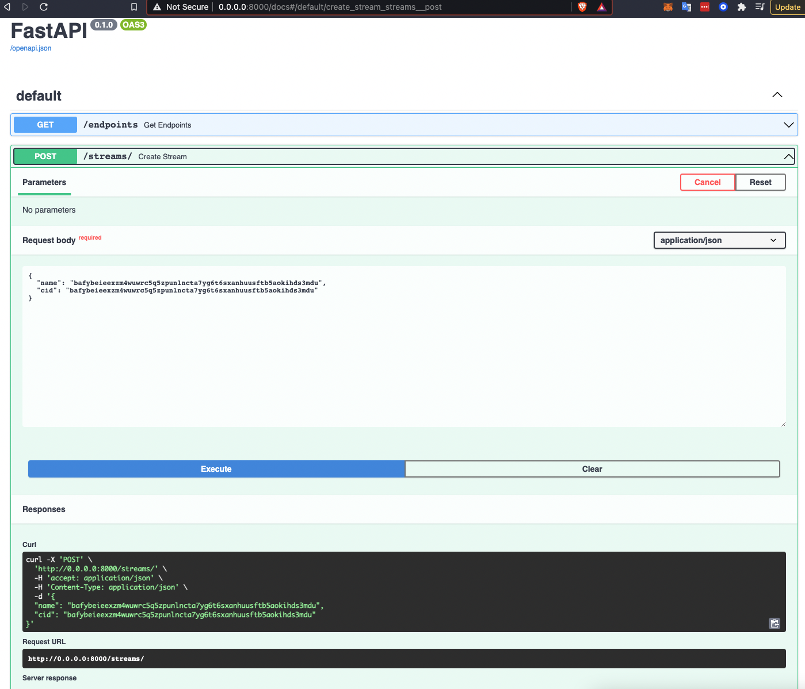

## LiveTube 
### A personal video tube site built on top of Filecoin, Textile, and Livepeer


liveTube is a tube site that allows videos to be uploaded to a collection within 
[slate.host](http://slate.host) and these videos are then deployed in the web app frontend.
Once the user chooses a video to stream in the frontend, a backend process is kicked off where a stream is created via ffmpeg pulling the video file from the ipfs gateway and sending it to Livepeer ingest endpoint.

### Technologies and how things work
- [NextJS](https://nextjs.org/): The frontend is a simple web app based on next.js 
- [Python/FastAPI](https://fastapi.tiangolo.com/): The [api](/ffmpeg_api/ffmpeg_server.py) is a python fastapi app that listens for POST requests in order to know which file cid's to create video streams for. Once the request comes in a stream is created in the [Livepeer](https://livepeer.com) platform via the Livepeer api. The api can be invoked directly via docs page located at [http://localhost:8000/docs](localhost:800).  
- [Slate](slate.host): Slate is used for uploading and storing videos and it's api is used for querying the video information. Slate is a file sharing network built on top of Textile and Filecoin
- [Livepeer](https://livepeer.com): Livepeer is used for creating video streams and transcoding videos for various device sizes. Livepeer is a decentralized video streaming network built on the Ethereum blockchain. 
- [ffmpeg](https://www.ffmpeg.org/): FFmpeg is used for streaming the video from the ipfs gateway to Livepeer's video ingestion endpoint.


### How to run:
1. Clone repo
```
git clone git@github.com:camharris/livetube.git
~~
cd livetube
```
2. Create a .env.local file in the `ffmpeg_api` directory with your Livepeer api key
```
echo LIVEPEER_API_KEY=YOUR_API_KEY > ffmpeg_api/.env.local
```
3. Create a .env.local file in the `livetube-app` directory with your slate api key and api address (the api address should be 'api')
```
echo NEXT_PUBLIC_SLATE_API_KEY=YOUR_SLATE_API_KEY > livetube-app/.env.local
echo NEXT_PUBLIC_LOCAL_API=api:8000 >> livetube-app/.env.local
```
4. Build containers and then docker-compose
```
docker-compose build
docker-compose up
```


## Issues/TODO
- Video streaming hasn't been implemented into the web app as of yet. however streams can be view/tested using [THEOplayer](https://demo.theoplayer.com/test-your-stream-with-statistics)
- The video page of the UI doesn't talk to the ffmpeg_api yet.